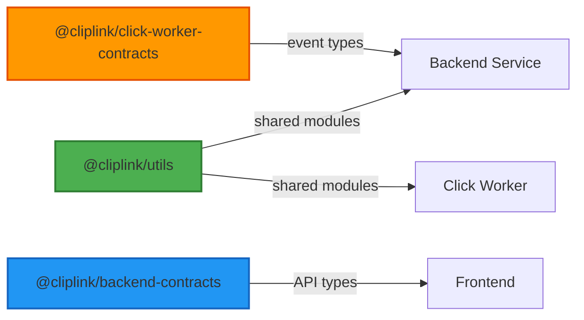

# Scalable URL Shortener System

A production-ready, microservices-based URL shortening platform designed for high concurrency and scalability.

This project is organized as a set of **independent repositories** within a GitHub Organization. This **Polyrepo** architecture ensures strict separation of concerns, while maintaining strict type safety across service boundaries via shared NPM packages.

---

## 🛠 Tech Stack

### Core


### Data & Messaging


### Infrastructure & CI/CD


---

## 🏗 Architecture Highlights

### 1. Contract-First Development (Shared NPM Packages)
Despite being physically separated repositories, the system acts as a cohesive unit thanks to **automated contract publishing**:
- **Backend**, **Click-Worker**, and **Utils** repositories all publish versioned NPM packages.
- On merge to `main`, GitHub Actions automatically build and publish these contracts to the GitHub Registry with semantic versioning.
- **Three-tier package architecture:**
  - `@cliplink/utils` - Shared utilities, NestJS module factories (TypeORM, BullMQ, Pino Logger), and common helpers.
  - `@cliplink/backend-contracts` - API DTOs and request/response types from `backend/src/_contracts`.
  - `@cliplink/click-worker-contracts` - Event schemas (e.g., `ClickCreatedEvent`) from `click-worker/src/_contracts`.

**Dependency Flow:**


- **Type Safety Across Boundaries:**
  - `click-worker` exports `ClickCreatedEvent` → **Backend** imports to publish strictly typed NATS events.
  - `backend` exports API DTOs → **Frontend** imports for 100% type-safe HTTP requests.
  - `utils` exports shared modules → Both **Backend** and **Click-Worker** use identical configurations.

### 2. Event-Driven Analytics (NATS JetStream)
Click tracking is fully decoupled using **Event-Driven Architecture**:
- **Gateway:** The Backend publishes a lightweight event to **NATS JetStream** immediately after redirecting the user.
- **Consumer:** A dedicated `click-worker` microservice subscribes to the stream.
- **Reliability:** JetStream ensures at-least-once delivery and durable message persistence.

### 3. Database Partitioning & Archiving
- **PostgreSQL Native Partitioning** is used for the `links` table.
- **Automation:** A **Redis-backed BullMQ repeatable job** creates monthly partitions in advance and archives old ones to a separate schema, keeping the active dataset lightweight.

### 4. High-Performance Writes (Batching)
- The `click-worker` buffers incoming NATS events and flushes them to PostgreSQL in **bulk batches**. This drastically reduces database IOPS.

---

## 🧩 Repositories & Services

### [Backend (NestJS)](https://github.com/cliplink/api-backend)
The core API service.
- **Features:** Link management, Auth (Passport: Local/JWT), Partition Scheduling.
- **CI/CD:** Publishes API contracts, builds Docker images.
- **Dependency:** Consumes `click-worker` contracts for NATS events.

### [Click Worker (NestJS)](https://github.com/cliplink/clicks)
Background processor.
- **Features:** NATS Consumer, Batch Database Writer.
- **CI/CD:** Publishes Event contracts, builds Docker images.

### [Frontend (Nuxt.js)](https://github.com/cliplink/frontend)
Modern SSR User Interface.
- **Features:** User dashboard, authentication flows.
- **Dependency:** Consumes `backend` contracts for 100% type-safe API integration.

### [Utils](https://github.com/cliplink/utils)
Shared library for common utilities and helpers, published as a private NPM package.
- **Features:** NestJS module factories (TypeORM, BullMQ, Pino Logger), reusable utilities.
- **CI/CD:** Automated versioning and publishing to GitHub Packages.
- **Dependency:** Used by both `backend` and `click-worker` for consistent configuration.

---

## 🧪 Quality Assurance

### Testing Strategy
- **Unit Tests:** Comprehensive coverage for business logic and utilities.
- **E2E Tests:** Full integration testing using dedicated `docker-compose.test.yml` with tmpfs volumes for fast, isolated test runs.
- **Contract Testing:** NPM packages ensure compile-time safety across service boundaries.

### Code Quality
- **Linting:** ESLint with strict TypeScript rules, import ordering, and Prettier integration.
- **Type Safety:** 100% TypeScript with strict mode enabled across all services.
- **CI Quality Gates:** All PRs must pass linting, tests, and build checks before merge.

---

## 🎯 Key Technical Achievements

- **Zero-downtime deployments** via Docker Swarm with rolling updates.
- **Horizontal scalability** - stateless services with shared Redis/PostgreSQL.
- **Performance optimization** - batch writes reduce database IOPS by ~80%.
- **Automated database maintenance** - partition management prevents table bloat.
- **Type-safe microservices** - contracts eliminate runtime type errors between services.
- **Observability** - structured logging with Pino for production debugging.

---

## 🚀 DevOps & Deployment

The system is fully containerized and supports various orchestration scenarios:

1.  **Local Development:** `docker-compose.dev.yml` with hot-reload for all services.
2.  **Production Readiness:** `docker-compose.prod.yml` is optimized for production workloads and can be used for deployment in a **Docker Swarm** cluster.
3.  **CI/CD Pipelines:** Every repository has automated workflows for:
    - Quality Gates (ESLint, Prettier, Tests).
    - Semantic Versioning for NPM packages.
    - Containerization (Images pushed to GHCR).
4.  **Testing Infrastructure:** `docker-compose.test.yml` uses **tmpfs** (in-memory) volumes for lightning-fast, stateless integration testing.

```bash
# Example: Deploying to production / Docker Swarm
npm run docker:prod
```